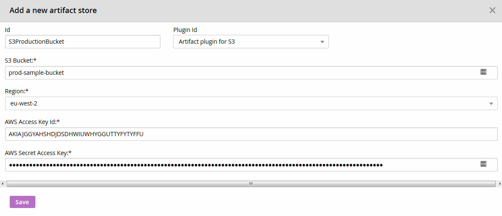
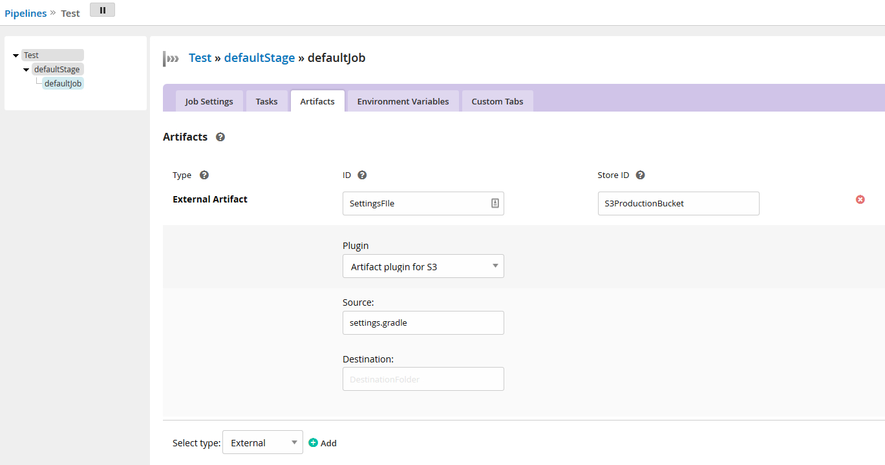
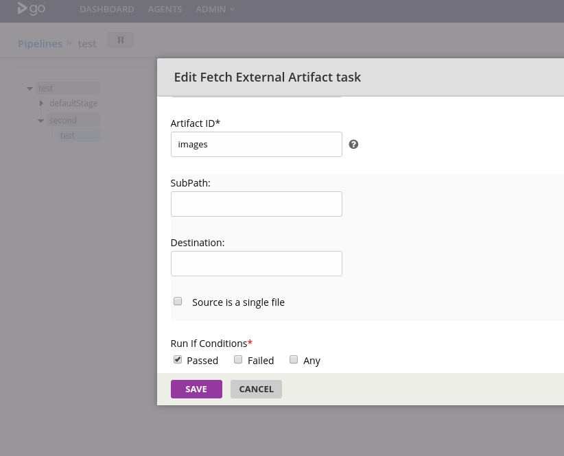

# GoCD S3 Artifact Plugin

The S3 artifact plugin provides a way to publish and fetch artifacts to/from AWS S3.

## Getting started

### Requirements

 - GoCD Server 18.7+
 - AWS account with access to S3 bucket

Following IAM policy should suffice to publish and fetch artifacts:
```json
{
  "Version": "2012-10-17",
  "Statement": [
    {
      "Effect": "Allow",
      "Action": [
        "s3:ListBucket"
      ],
     "Resource": [
        "arn:aws:s3:::my-artifacts-bucket"
      ]
    },
    {
      "Action": [
        "s3:GetObject",
        "s3:HeadBucket",
        "s3:PutObject"
      ],
      "Effect": "Allow",
      "Resource": "arn:aws:s3:::my-artifacts-bucket/*"
    }
  ]
}
```
Note: Action `s3:DeleteObject` is not needed, plugin does not delete any objects.

### Plugin Installation

Build the plugin as mentioned above.

Copy the file `build/libs/s3-artifact-plugin-VERSION.jar` to the GoCD server under `${GO_SERVER_DIR}/plugins/external` and restart the server.

### Plugin Configuration

There are three levels of configuration needed in order for publishing and fetching a file using AWS S3.

#### Configure the Artifact Store

1. Login to GoCD server as admin and navigate to Admin > Artifact Stores
2. Click on `Add` to add the store details for the plugin.
   - Specify the store id (an identifier you wish to give to this store)
   - Choose the Artifact plugin for S3
   - Specify the `S3 Bucket` and `S3 Region`
   - Specify the `AWS Access Key Id` and `AWS Secret Access Key`

   

See [specification](#specification) lower for more details.

#### Publish artifact config

Options:
 * `Source` - ant-like pattern for matching files to upload to S3. If directory is matched, all files of that directory are also uploaded.
 * `Destination` - a prefix in S3 bucket at which files will be uploaded.

Setup through Web UI:
1. Navigate to the `Artifacts` tab under Stage > Job
2. Choose artifact type `External`
   - Specify the `artifact id`.
   - Specify the `store id` of an existing artifact store
3. Configure the build specific artifact details.
   - Specify the `Source` files pattern
   - Optionally specify the `Destination`, which is a folder path to where artifacts will be uploaded in your S3 bucket. If left empty, the file will be uploaded to the root of the S3 bucket you have specified.

   

See [specification](#specification) lower for more details.

#### Fetch artifact config

Options:
 * `IsFile` - determines if we are fetching just a single file.
 * `SubPath` - When fetching many files, a common prefix of objects in S3 bucket. When fetching single file: this can be a path in S3. It is possible to skip the path if upstream job has uploaded exactly 1 file. The **SubPath** should not include the `Destination` part of [publish artifact config](#publish-artifact-config), see [specification](#specification) lower for more details.
 * `Destination` - a local subdirectory into which files will be fetched.


Setup through Web UI:
1. Specify a `Pipeline Dependency` material if you have an upstream pipeline with artifacts to fetch.
2. Navigate to `Tasks` tab under Stage > Job
3. Add a `Fetch Artifact` task
   - Choose artifact origin type `External`
   - Specify the pipeline, stage and job name.
   - Specify the artifact id of the external artifact that belongs to the upstream job
   - Optionally specify `SubPath` to fetch only files matching a prefix.
   - Optionally specify `Destination` to fetch files to a custom directory.
   - Optionally select `Source is a single file`.

   

See [specification](#specification) lower for more details.

# Specification

Plugin partially mimics behaviour of the original GoCD artifact store.

## How the plugin works

#### Upload

 - on GoCD agent, files are matched using the `Source` configuration value.
 - agent uploads each file to AWS S3 Bucket, at `Destination` prefix.
 - on GoCD server a small JSON file is created in `pluggable-artifact-metadata`, (unique per job run):
```json
{
  "Source" : "**/*.dll",
  "Destination" : "my/prefix",
  "IsFile" : false
}
```

 * `Source` is a pattern which user has provided in the artifact publish config. Except when there was exactly one match, then source is a path from which file was uploaded. E.g. in above example it could be `bin/my.dll` if there was just one `.dll` file in any directory.
 * `Destination` is user specified prefix at which all uploaded artifacts should land. E.g. if a `bin/my.dll` was matched, then plugin uploaded file to `my/prefix/bin/my.dll`
 * `IsFile` is set to `true` only when plugin found exactly one file matching the pattern.

#### Fetch

 - GoCD agent fetches the JSON file from server in `pluggable-artifact-metadata`
 - GoCD agent **always** adds a prefix before each S3 object download with `Destination` which was earlier saved in the JSON file.

If **fetch is a single file** and **upstream upload was a single file** (pattern matching only 1 file):
Then GoCD agent will use `Source` field from the JSON to determine the S3 path to use for download.

If **fetch is a single file** but **upstream upload was uploaded multiple files**:
Then user must specify `SubPath` in the fetch configuration.
GoCD agent will use `SubPath` to determine the S3 path to use for download.

If **fetch is of multiple files**:
Then there are no required options.
GoCD agent will use a [List S3 Objects](https://docs.aws.amazon.com/AmazonS3/latest/API/v2-RESTBucketGET.html) request to determine which objects to download. If `SubPath` is specified, then only objects starting with a `SubPath` will be downloaded.
If no files match, then fetch task fails.

## Expanding environment variables

The `Destination` of the publish artifact config supports expanding environment variables available within the GoCD job context.
That means that you can specify destination S3 prefix using e.g. `${GO_PIPELINE_NAME}/my/path/${GO_PIPELINE_COUNTER}`.

One of the most important uses of this feature is when destination directory is specified by `${GO_PIPELINE_NAME}/${GO_PIPELINE_COUNTER}/${GO_STAGE_NAME}/${GO_STAGE_COUNTER}/${GO_JOB_NAME}`.
Such destination is unique for each build. It is the same tree structure which original GoCD artifact store uses.
This plugin provides a convenience `${GO_ARTIFACT_LOCATOR}` which evaluates to above expression.

If you decide to use `${GO_ARTIFACT_LOCATOR}` as destination prefix in all your GoCD jobs, then S3 bucket will have the same artifact "directory" structure as original GoCD would.

## Examples

Examples below should suffice to understand the expected behavior.

### Single file upload

**Scenario 1:**
 * agent working directory has `./build.json` file.
 * configured `Source` pattern is `build.json`

**Result:**
On GoCD server:
```json
{
"Source" : "build.json",
"Destination" : "",
"IsFile" : true
}
```
On AWS bucket `/build.json`.

**Scenario 2:**
 * agent working directory has `./bin/build.json` file.
 * configured `Source` pattern is `*/build.json`

**Result:**
 On GoCD server:
```json
{
  "Source" : "bin/build.json",
  "Destination" : "",
  "IsFile" : true
}
```
On AWS bucket `/bin/build.json`.

**Scenario 3:**
  * agent working directory has `./bin/build.json` file.
  * configured `Source` pattern is `*/build.json`
  * configured `Destination` prefix is `x/y`

**Result:**
On GoCD server:
```json
{
  "Source" : "bin/build.json",
  "Destination" : "x/y",
  "IsFile" : true
}
```
On AWS bucket `x/y/bin/build.json`.

### Many files upload

**Scenario 1:**
 * agent working directory has `./bin/build.json` and `./bin/a.bin` files.
 * configured `Source` pattern is `bin`

**Result:**
On GoCD server:
```json
{
  "Source" : "bin",
  "Destination" : "",
  "IsFile" : false
}
```
On AWS bucket: `/bin/build.json` and `/bin/a.bin`.

**Scenario 2:**
 * agent working directory has `./bin/build.json` and `./bin/a.bin` files.
 * configured `Source` pattern is `bin`
 * configured `Destination` prefix is `x/y`

**Result:**
On GoCD server:
```json
{
  "Source" : "bin",
  "Destination" : "x/y",
  "IsFile" : false
}
```
On AWS bucket: `/x/y/bin/build.json` and `/x/y/bin/a.bin`.

### Fetch single file

**Scenario 1:**
 * no options configured in fetch task
 * upstream upload was a single file upload.

On GoCD we have
```json
{
"Source" : "bin/build.json",
"Destination" : "",
"IsFile" : true
}
```
On AWS bucket `/bin/build.json`

**Result:**
Agent will fetch `bin/build.json` to `./build.json`.


**Scenario 2:**
 * configuration in fetch task - `Destination: z`
 * upstream upload was a single file upload.

On GoCD we have
```json
{
  "Source" : "bin/build.json",
  "Destination" : "",
  "IsFile" : true
}
```
On AWS bucket `/bin/build.json`.
Agent will fetch `bin/build.json` to `z/build.json`.

### Fetch directory (prefix)

**Scenario 1:**
 * no options configured in fetch task

On GoCD we have:
```json
{
  "Source" : "bin",
  "Destination" : "x/y",
  "IsFile" : false
}
```
On AWS bucket:
 - `/x/y/bin/build.json`
 - `/x/y/bin/a.bin`
 - `/abc/ignored`

Agent will fetch
 - `x/y/bin/build.json` to `./bin/build.json`
 - `x/y/bin/a.bin` to `./bin/a.bin`

# Development

## Building the code base

If you have local java SDK, then to build the code base just execute:

- `./gradlew clean test assemble` on Unix based systems
- `gradlew.bat clean test assemble` on Windows

## Building with docker and dojo

You don't need to setup java on your host, if you are fine with using docker and [Dojo](https://github.com/ai-traders/dojo).

Assuming you already have a working docker, you can install dojo with:
```
DOJO_VERSION=0.5.0
wget -O dojo https://github.com/ai-traders/dojo/releases/download/${DOJO_VERSION}/dojo_linux_amd64
sudo mv dojo /usr/local/bin
sudo chmod +x /usr/local/bin/dojo
```
Then enter a docker container with java pre-installed, by running following command at the root of the project:
```
dojo
```
You can also build the plugin in single line:
```sh
dojo "./gradlew clean test assemble"
```

Running integration tests:
 * Requires access to S3 bucket. This can be provisioned by terraform in `e2e/terraform`. Run with `./tasks tf_apply create`.
 * Terraform creates S3 bucket and a user with limited access, credentials are in `e2e/terraform/tf-out.json`.
 * To run all tests including integration:
```
./tasks build_test
```

## License

```plain
Copyright 2019 Tomasz Sętkowski
Copyright 2018 Diogomrol
Copyright 2018 ThoughtWorks, Inc.

Licensed under the Apache License, Version 2.0 (the "License");
you may not use this file except in compliance with the License.
You may obtain a copy of the License at

    http://www.apache.org/licenses/LICENSE-2.0

Unless required by applicable law or agreed to in writing, software
distributed under the License is distributed on an "AS IS" BASIS,
WITHOUT WARRANTIES OR CONDITIONS OF ANY KIND, either express or implied.
See the License for the specific language governing permissions and
limitations under the License.
```

## About the license and releasing your plugin under a different license

The code in this repository is licensed under the Apache 2.0 license. The license itself specifies the terms
under which derivative works may be distributed (the license also defines derivative works). The Apache 2.0 license is a
permissive open source license that has minimal requirements for downstream licensors/licensees to comply with.

This does not prevent your plugin from being licensed under a different license as long as you comply with the relevant
clauses of the Apache 2.0 license (especially section 4). Typically, you clone this repository and keep the existing
copyright notices. You are free to add your own license and copyright notice to any modifications.

This is not legal advice. Please contact your lawyers if needed.
