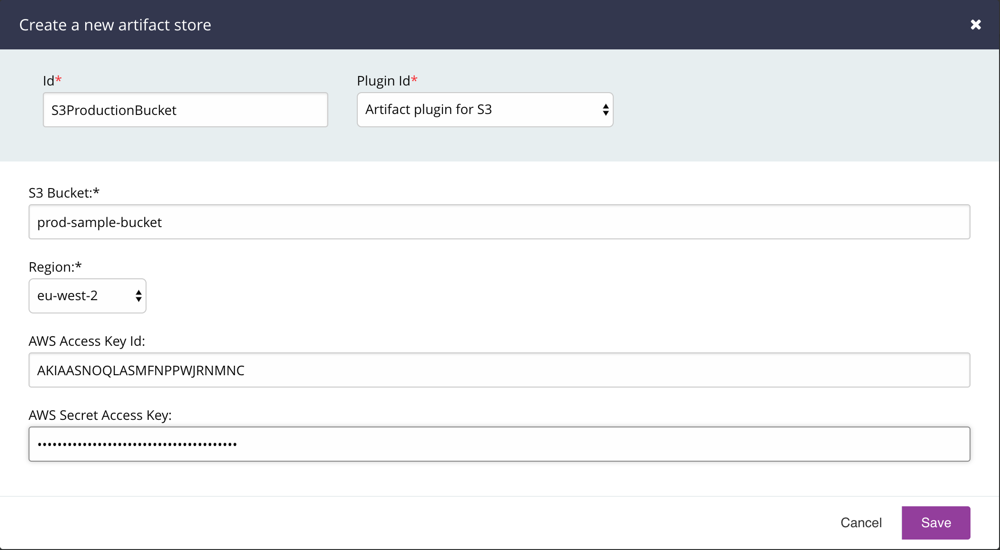

# GoCD S3 Artifact Plugin

The S3 artifact plugin provides a way to publish and fetch artifacts to/from AWS S3.

## Building the code base

To build the code base just execute:

`./gradlew clean test assemble` on Unix based systems
`gradlew.bat clean test assemble` on Windows

## Getting started

### Requirements

- GoCD Server 18.7+

### Plugin Installation

Build the plugin as mentioned above.

Copy the file `build/libs/s3-artifact-plugin-VERSION.jar` to the GoCD server under `${GO_SERVER_DIR}/plugins/external` and restart the server.

### Plugin Configuration

There are three levels of configuration needed in order for publishing and fetching a file using AWS S3.

#### Configure the Artifact Store

1. Login to GoCD server as admin and navigate to Admin > Artifact Stores
2. Click on `Add` to add the store details for the plugin.
   - Specify the store id (an identifier you wish to give to this store)
   - Choose the Artifact plugin for S3
   - Specify the `S3 Bucket` and `S3 Region`
   - Specify the `AWS Access Key Id` and `AWS Secret Access Key`

   

#### Publish artifact config

1. Navigate to the `Artifacts` tab under Stage > Job
2. Choose artifact type `External`
   - Specify the `artifact id`.
   - Specify the `store id` of an existing artifact store
3. Configure the build specific artifact details.
   - Specify the `Source` file
   - Optionally specify the `Destination`, which is a folder path to where artifacts will be uploaded in your S3 bucket. If left empty, the file will be uploaded to the root of the S3 bucket you have specified.

   

#### Fetch artifact config

To pull an image from an upstream pipeline or stage, the following information is required:

1. Specify a `Pipeline Dependency` material if you have an upstream pipeline you want to pull the docker image.
2. Navigate to `Tasks` tab under Stage > Job
3. Add a `Fetch Artifact` task
   - Choose artifact origin type `External`
   - Specify the pipeline, stage and job name.
   - Specify the artifact id of the external artifact that belongs to the upstream job

## License

```plain
Copyright 2018 Diogomrol
Copyright 2018 ThoughtWorks, Inc.

Licensed under the Apache License, Version 2.0 (the "License");
you may not use this file except in compliance with the License.
You may obtain a copy of the License at

    http://www.apache.org/licenses/LICENSE-2.0

Unless required by applicable law or agreed to in writing, software
distributed under the License is distributed on an "AS IS" BASIS,
WITHOUT WARRANTIES OR CONDITIONS OF ANY KIND, either express or implied.
See the License for the specific language governing permissions and
limitations under the License.
```

## About the license and releasing your plugin under a different license

The code in this repository is licensed under the Apache 2.0 license. The license itself specifies the terms
under which derivative works may be distributed (the license also defines derivative works). The Apache 2.0 license is a
permissive open source license that has minimal requirements for downstream licensors/licensees to comply with.

This does not prevent your plugin from being licensed under a different license as long as you comply with the relevant
clauses of the Apache 2.0 license (especially section 4). Typically, you clone this repository and keep the existing
copyright notices. You are free to add your own license and copyright notice to any modifications.

This is not legal advice. Please contact your lawyers if needed.
